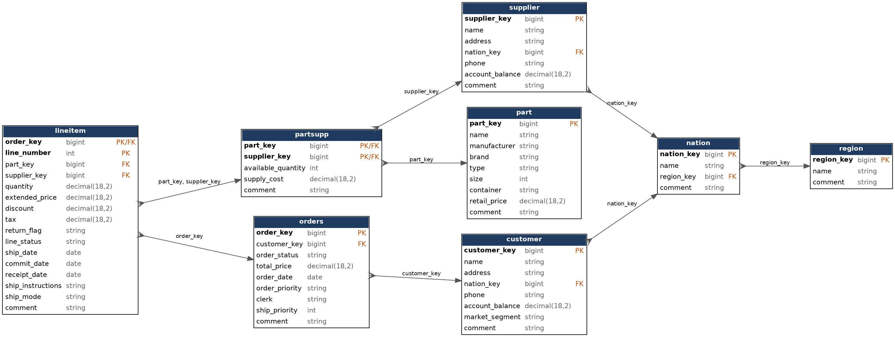
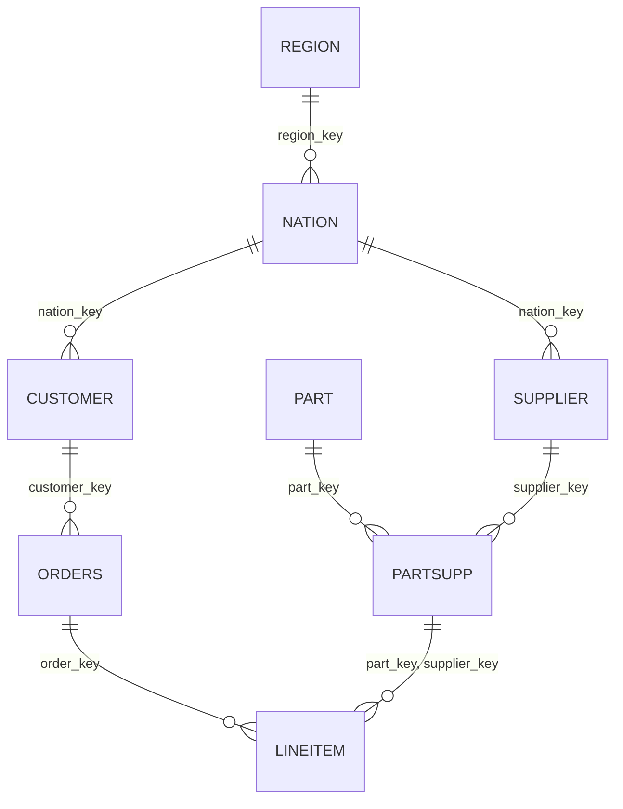
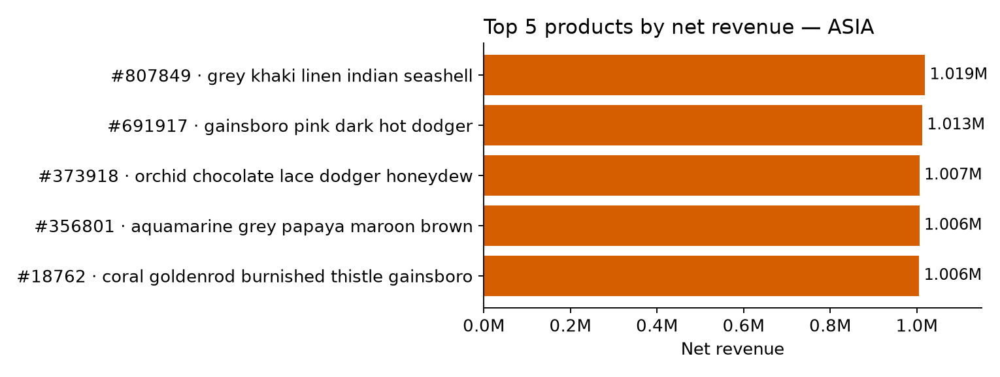
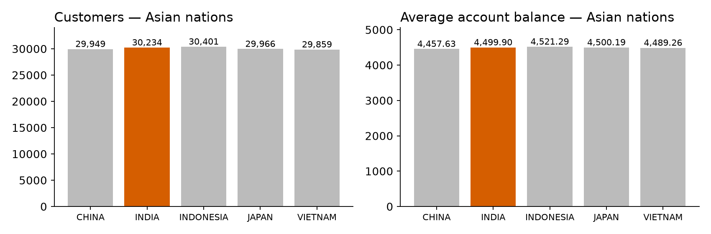
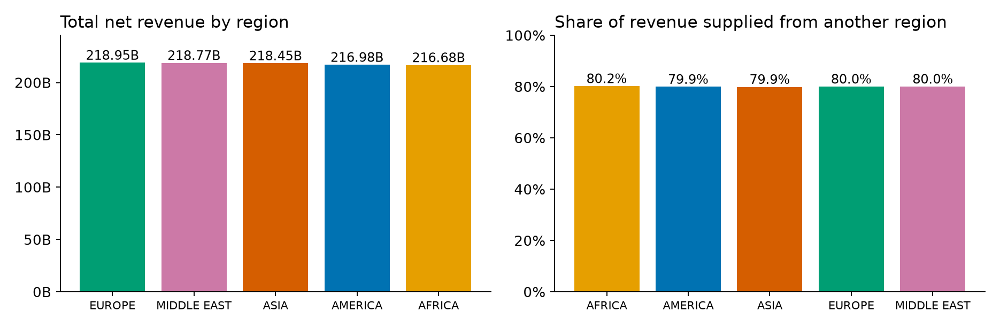
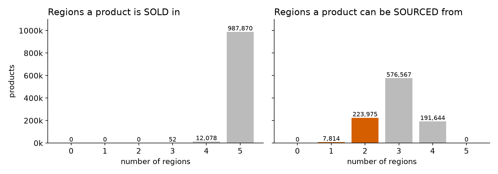
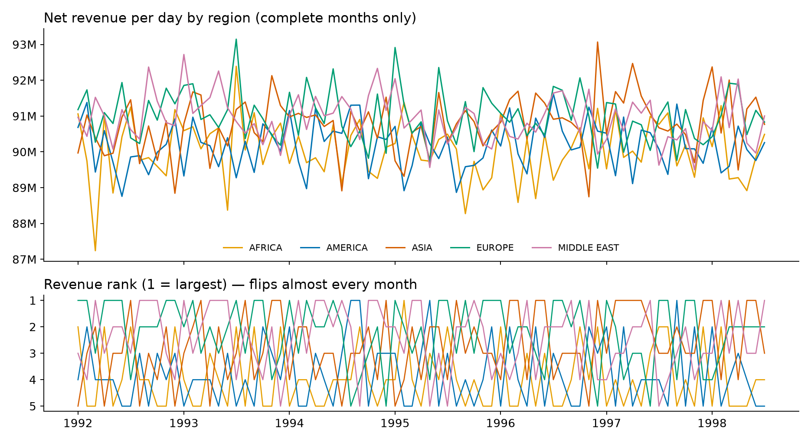

# TPC-H Lakehouse — Regional Manager

Group Assignment 1. We migrate the TPC-H wholesale-supplier data (`samples.tpch`) into a
**bronze → silver → gold** lakehouse on Databricks and use the gold layer to answer the
**Regional Manager's** questions: top products by region, regional revenue ranking, and
products with limited geographical coverage.

| | |
|---|---|
| **Presentation** | `<ADD LINK TO THE SLIDES HERE>` |
| **Team** | `<Name 1>` — bronze & silver · `<Name 2>` — gold & business questions · `<Name 3>` — validation, monitoring & alerts · `<Name 4>` — repo, README, presentation |
| **Stack** | Databricks (Unity Catalog, Delta, serverless), PySpark + Spark SQL, `uv`, pytest |

---

## 1. What is in the repo

```
├── notebooks/                 thin Databricks notebooks – run these in order
│   ├── _common.py             widgets + config (included with %run)
│   ├── 01_bronze.py           source → bronze, as is
│   ├── 02_silver.py           bronze → silver (3NF, quality rules, quarantine, constraints)
│   ├── 03_gold.py             silver → gold star schema + aggregates
│   ├── 04_validation.py       43 cross-layer checks, fails on any violation
│   ├── 05_business_questions.py   the 4 questions: SQL + charts
│   └── 06_monitoring_alerts.py    revenue by region over time + alert rules + demo
├── src/tpch_lakehouse/        all logic lives here (importable, unit-testable)
│   ├── config.py              every catalog / schema / table name – nothing is hard-coded elsewhere
│   ├── bronze.py  silver.py  gold.py
│   ├── validation.py  questions.py  monitoring.py
├── tests/                     pytest suite – runs the whole pipeline on local Spark
├── scripts/                   local runner, local TPC-H generator, ER-diagram renderer
├── sql/alert_region_revenue.sql   query for the Databricks SQL alert
├── docs/                      ER diagram (png / svg / mermaid) and result charts
├── databricks.yml + resources/    Databricks Asset Bundle: one job that runs everything
└── pyproject.toml + uv.lock   uv project
```

## 2. How to run it

### In Databricks (the real thing)

1. **Workspace → Create → Git folder** and paste this repo's URL.
2. Open `notebooks/01_bronze.py`, attach serverless compute, and set the widgets
   (defaults work on a standard workspace):

   | widget | default | meaning |
   |---|---|---|
   | `catalog` | `workspace` | target catalog (must exist) |
   | `env` | `dev` | `dev` / `preprod` / `prod` – becomes part of the schema name |
   | `source_catalog`, `source_schema` | `samples`, `tpch` | where TPC-H lives |

3. Run `01` → `02` → `03` → `04` → `05` → `06`.

Or deploy everything as a job with the bundle:

```bash
databricks bundle deploy -t dev
databricks bundle run tpch_regional_pipeline -t dev
```

### On a laptop (tests, no Databricks needed)

```bash
uv sync                              # creates .venv from uv.lock
uv run pytest                        # 16 tests: full pipeline on local Spark, TPC-H SF 0.01
uv run python scripts/run_local.py   # same, but prints every table and answer
```

Needs Java 17+ for Spark. Local runs use parquet tables instead of Delta; the code path is
otherwise identical (only `Config` differs).

## 3. Portability and the "pre-production only" assumption

* **One naming rule:** `<catalog>.<project>_<env>_<layer>.<table>`, e.g.
  `workspace.tpch_dev_silver.customer`. It is implemented once, in `config.py`. Moving to
  another workspace or promoting dev → preprod → prod changes widget values or bundle
  variables — never code.
* **We only ever see pre-production data**, so nothing in the solution depends on specific
  data values: there are no hard-coded keys, dates or expected totals. Quality rules are
  structural (keys resolve, amounts are positive, layers reconcile), "complete month" is
  derived from the data's own min/max date, and alert thresholds are parameters in `Config`.
* Because pre-prod data is clean, we cannot *wait* for a bad row or a revenue drop to prove the
  safety nets work. Both are demonstrated by **injecting** faults: broken rows in
  `04_validation`, a simulated 30% regional drop in `06_monitoring_alerts`.

## 4. The layers

### Bronze — as is
8 tables copied 1:1 from `samples.tpch`. Same column names, same types, no filter.
Only `_ingested_at` and `_source_table` are added for lineage. Full-snapshot overwrite, so
re-running is idempotent.

### Silver — 3NF with enforced data quality



<details><summary>Mermaid version (renders on GitHub)</summary>


</details>

**Why this is 3NF.** TPC-H is already a normalised model, so silver keeps its eight entities.
1NF: every column is atomic. 2NF: in the two tables with a composite key (`partsupp`,
`lineitem`) every non-key column depends on the whole key. 3NF: no non-key column depends on
another non-key column — nation and region *names* are not repeated on customers or suppliers;
they are reached through `nation_key → region_key`. What silver changes is names and types:
the `c_`/`o_`/`l_` prefixes are dropped (`c_custkey` → `customer_key`), money is
`decimal(18,2)`, strings are trimmed. `orders.total_price` is kept: it is derivable from the
line items, but it is a fact about the order that depends only on the order key, so it does
not break 3NF.

**How quality is enforced.** Each table is declared once in `silver.SPECS`: columns, primary
key, NOT NULL columns, CHECK rules and foreign keys. A generic rule engine then:

1. evaluates every rule for every row and records the failed rule names;
2. writes passing rows to `<table>` and failing rows to `<table>_quarantine` (with the reasons)
   — **nothing is silently dropped**: `bronze = silver + quarantine` is itself a validation check;
3. checks foreign keys against the already-cleaned parent, in dependency order, so a child of a
   quarantined parent is quarantined too;
4. puts `NOT NULL`, `CHECK`, `PRIMARY KEY` and `FOREIGN KEY` constraints on the Delta tables.
   NOT NULL and CHECK are enforced by Delta on every later write. PK/FK are *informational* in
   Unity Catalog (the engine does not enforce them) — which is exactly why step 1–3 exist.

| table | primary key | foreign keys | checks |
|---|---|---|---|
| region | region_key | — | name not blank |
| nation | nation_key | region_key → region | name not blank |
| customer | customer_key | nation_key → nation | nation / balance not null |
| supplier | supplier_key | nation_key → nation | nation not null |
| part | part_key | — | retail_price > 0 |
| partsupp | (part_key, supplier_key) | part, supplier | supply_cost ≥ 0 |
| orders | order_key | customer_key → customer | order_date not null |
| lineitem | (order_key, line_number) | order; (part_key, supplier_key) → partsupp | quantity > 0, price > 0, 0 ≤ discount ≤ 1 |

### Gold — shaped for the Regional Manager

A small star schema plus three aggregates.

| table | grain | answers |
|---|---|---|
| `dim_geography` | nation | the nation → region hierarchy |
| `dim_customer` | customer (incl. customers with no orders) | Q2 |
| `dim_supplier`, `dim_part` | supplier / part | labels, supply-side coverage |
| `fact_sales` | order line | Q3 cross-region share; base for all aggregates |
| `agg_region_revenue_monthly` | region × month | Q3 ranking, monitoring |
| `agg_part_region_revenue` | part × region | Q1 |
| `agg_part_coverage` | part (incl. never-sold parts) | Q4 |
| `region_revenue_alerts` | region × complete month | alerting |

`fact_sales` carries **both** geographies for each line — the customer's nation/region and the
supplier's — plus `is_cross_region`, so the two roles can never be mixed up in a query.

## 5. Definitions (one per number, used by every query)

| term | definition |
|---|---|
| **Net revenue** | `extended_price × (1 − discount)`. Tax is excluded (it is not the company's money). |
| **Region of a sale** | the region of the **customer** who placed the order. |
| **Cross-region sale** | customer region ≠ supplier region. |
| **Period** | by **order date** (not ship or receipt date). |
| **Complete month** | a month fully covered by the data. The data ends on 1998-08-02, so August 1998 is partial and is excluded from every month-over-month comparison and alert. |
| **Product** | a `part` (identified by `part_key`). |

The revenue expression exists in exactly one place per layer (`gold.py` for gold,
`validation.BRONZE_REVENUE` / `SILVER_REVENUE` for reconciliation), and every business query
is a named template in `questions.py`.

## 6. Answers to the business questions

> **Read this first.** The figures below were computed with this repo's gold SQL on a
> **local replica**: TPC-H generated with the standard `dbgen` at scale factor 5, which has
> the same row counts as `samples.tpch` (29,999,795 line items, 7,500,000 orders, 750,000
> customers). They should match Databricks exactly, but **re-run `05_business_questions` in
> your workspace and replace anything that differs** before presenting.

**Q1 — Top 5 products by revenue in Asia**

| # | part_key | product | brand | net revenue |
|---|---|---|---|---|
| 1 | 807849 | grey khaki linen indian seashell | Brand#54 | 1,019,365.63 |
| 2 | 691917 | gainsboro pink dark hot dodger | Brand#11 | 1,013,138.06 |
| 3 | 373918 | orchid chocolate lace dodger honeydew | Brand#34 | 1,006,606.66 |
| 4 | 356801 | aquamarine grey papaya maroon brown | Brand#21 | 1,006,420.57 |
| 5 | 18762 | coral goldenrod burnished thistle gainsboro | Brand#54 | 1,005,901.24 |



There is no runaway bestseller: #1 is only 1.3% ahead of #5, and each of the top five sold
through just 14–19 order lines.

**Q2 — Customers in India:** **30,234** customers, average account balance **4,499.90**.



**Q3 — Highest-revenue region and cross-region share**

| rank | region | net revenue | share |
|---|---|---|---|
| 1 | EUROPE | 218,954,324,383.88 | 20.09% |
| 2 | MIDDLE EAST | 218,773,014,374.58 | 20.07% |
| 3 | ASIA | 218,445,802,361.88 | 20.04% |
| 4 | AMERICA | 216,983,842,403.16 | 19.91% |
| 5 | AFRICA | 216,678,195,723.70 | 19.88% |

**Europe** is first, but only 1.05% ahead of last-placed Africa. **79.99%** of revenue
(871.8B of 1,089.8B) comes from sales where the customer and the supplier are in different
regions — almost exactly the 4-in-5 you would get if suppliers were picked with no regard to
geography.



**Q4 — Products sold in only one or two regions**

No. Of 1,000,000 products, 987,870 sell in all five regions, 12,078 in four, 52 in three and
**none in one or two** (and none is unsold). The products with narrower reach are simply the
ones with fewer order lines (18 on average for three regions against 30 for five), so here
limited coverage is a small-sample effect, not a market signal.

What it *would* indicate in a real business: a regional taste or regulation, a missing
distribution channel, or a new product still rolling out — a candidate for either expansion
or delisting.

The limited coverage is on the **supply** side: each product has four suppliers, and
**231,789 products (23.2%) can only be sourced from one or two regions** (7,814 from a single
region). Combined with the 80% cross-region share, that is a logistics-cost and
supply-concentration risk the Regional Manager should know about.



## 7. Validation — how we show the numbers can be trusted

`04_validation` runs every check as one SQL statement that returns the **number of
violations** (0 = pass), appends the results to `<ops>.dq_results`, and fails the job on any
violation. 43 checks in three groups:

| group | profile rule | what is checked |
|---|---|---|
| **GEOGRAPHY** | *Every customer and supplier resolves to a valid nation, and every nation to a valid region.* | Anti-joins customer → nation, supplier → nation, nation → region on **bronze** (a statement about the source) and again on **silver** (must hold by construction); geography quarantine tables are empty; each nation maps to exactly one region; every fact row has both a customer region and a supplier region. |
| **REVENUE** | *Revenue attributed to a region sums correctly and doesn't double-count across regions.* | The same net revenue in bronze = silver = gold fact = Σ regions = Σ part×region (to the cent); per-region revenue **recomputed independently from bronze** equals gold for every region; line counts across regions add up to the fact row count; monthly shares sum to 100%. |
| **COMPLETENESS** | (supports both) | bronze row count = source; silver + quarantine = bronze; primary keys unique; fact row count = line items (the joins neither dropped nor duplicated a row); customers without orders are still in `dim_customer`. |

Why double counting cannot happen: a sale is attributed to exactly one region because
order → customer → nation → region is a chain of many-to-one links, each proven unique by a
check above.

The pytest suite adds the negative cases — a customer with an unknown nation, a missing
nation, a duplicate key, a nation with an unknown region, a line item whose (part, supplier)
pair does not exist — and asserts each one is quarantined with the right reason.

## 8. Monitoring and alerting

**Monitor:** `agg_region_revenue_monthly` — revenue, revenue per day, share and rank for every
region and month (`06_monitoring_alerts` charts it).



**Alert rules** (evaluated on complete months only; thresholds are `Config` parameters):

| rule | fires when | default |
|---|---|---|
| `VOLUME_DROP` / `VOLUME_SPIKE` | revenue **per day** deviates from the region's trailing 3-month average | ≥ 5% |
| `RANK_LOSS` / `RANK_GAIN` | the region's rank changed **and** its revenue share moved away from its trailing 3-month average | ≥ 1 percentage point |

How the thresholds were chosen — by profiling 79 complete months × 5 regions (same local
replica as above; notebook 06 recomputes the table):

* Month-to-month change in revenue per day has a standard deviation of **0.94%** and never
  exceeded **3.35%**. 5% is about five standard deviations: silent on all of history, loud on a
  real problem.
* Per **day**, not per month: February is ~10% shorter than January, so a per-month rule would
  fire every year.
* **Rank alone is noise.** The regions are within ~1% of each other, so a region's rank changes
  in 78% of month-to-month comparisons (303 of 390). An alert on rank would fire constantly, so a rank
  change only counts when the region's share also moved ≥ 1 pp (the largest move in history is
  0.61 pp).

**Demo:** the notebook cuts ASIA's latest complete month by 30% in memory and re-runs the same
function; ASIA is flagged `VOLUME_DROP, RANK_LOSS`. The persisted
`region_revenue_alerts` table feeds a Databricks SQL alert (`sql/alert_region_revenue.sql`,
condition `alerts > 0`).

## 9. Challenges we faced

* **Constraints that don't constrain.** Unity Catalog accepts PRIMARY KEY / FOREIGN KEY but
  does not enforce them, so "enforced data quality" had to be built into the pipeline
  (rule engine + quarantine) and proven by validation.
* **Clean data hides broken checks.** Every rule passes on TPC-H, which says nothing about
  whether the rule works. We had to inject bad rows and a fake revenue drop to prove it.
* **"Which region?" is ambiguous.** A sale has a customer region and a supplier region; mixing
  them silently changes every answer. We fixed one written definition and kept both on the fact.
* **The benchmark is uniform.** Regions differ by ~1%, so a naive "rank changed" alert fires
  almost every month. The thresholds had to come from profiling, not intuition.
* **The last month is partial** (data ends 1998-08-02) and looks like a 93% crash unless
  incomplete periods are excluded.
* **Portability.** No hard-coded names; notebooks import shared code from `src/` so the same
  logic runs in a Git folder, as a bundle job, and in local tests.
